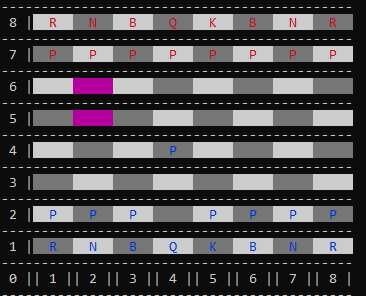

# Chess Console Game
This is a chess game implemented in C# that can be played in the console. It provides all the standard mechanics of chess, including promotion, en passant, and castling. Additionally, it allows players to undo moves during the game.



## Prerequisites
To run this project, you need to have the .NET Core SDK installed on your machine.

## Getting Started
To get started with the Chess Console Game, follow the steps below:

1. Clone the repository to your local machine using the following command:
```command
git clone https://github.com/consolelogreece/chess.git
```
2. Build the project
```command
dotnet build
```

3. Navigate to /chess directory

4. Run
```command
dotnet run
```

## Gameplay
Once the game is running, you will be presented with a chessboard representation in the console. The board is displayed using numbers, with ranks and files represented by numbers (1-8) (in future I plan update it to represent files as letters a-h).

All chess rules supported, including promotion, en passant, and castling. Moves can also be undone. There is also a primitive and presently incomplete AI (optional, but at the moment this application can only really be used by two users taking turns on the same device).

## License
This project is licensed under the [MIT](https://www.mit.edu/~amini/LICENSE.md) license.
